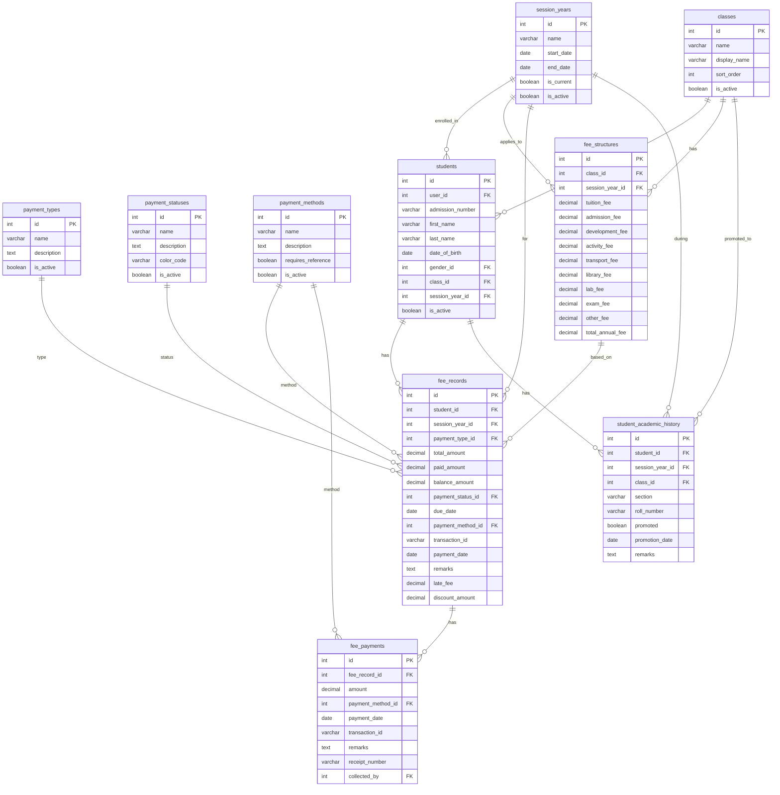
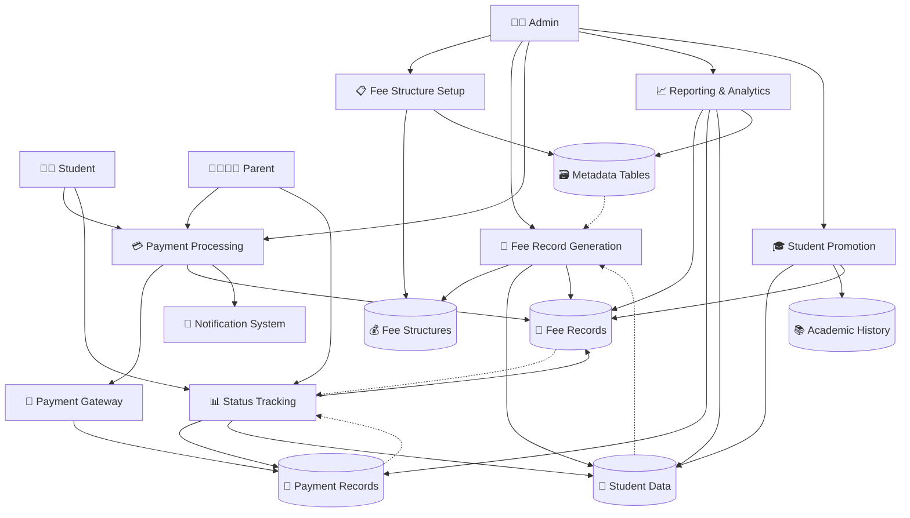
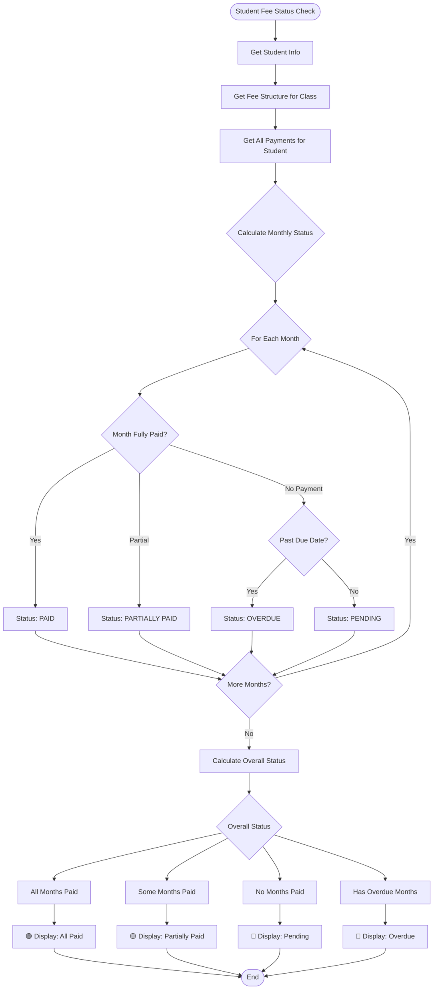
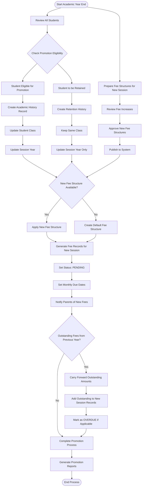

# Fee Management System Diagrams

## Diagram 1: Database Schema

```mermaid
erDiagram
    session_years {
        int id PK
        varchar name
        date start_date
        date end_date
        boolean is_current
        boolean is_active
    }
    
    classes {
        int id PK
        varchar name
        varchar display_name
        int sort_order
        boolean is_active
    }
    
    payment_types {
        int id PK
        varchar name
        text description
        boolean is_active
    }
    
    payment_statuses {
        int id PK
        varchar name
        text description
        varchar color_code
        boolean is_active
    }
    
    payment_methods {
        int id PK
        varchar name
        text description
        boolean requires_reference
        boolean is_active
    }
    
    students {
        int id PK
        int user_id FK
        varchar admission_number
        varchar first_name
        varchar last_name
        date date_of_birth
        int gender_id FK
        int class_id FK
        int session_year_id FK
        boolean is_active
    }
    
    fee_structures {
        int id PK
        int class_id FK
        int session_year_id FK
        decimal tuition_fee
        decimal admission_fee
        decimal development_fee
        decimal activity_fee
        decimal transport_fee
        decimal library_fee
        decimal lab_fee
        decimal exam_fee
        decimal other_fee
        decimal total_annual_fee
    }
    
    fee_records {
        int id PK
        int student_id FK
        int session_year_id FK
        int payment_type_id FK
        decimal total_amount
        decimal paid_amount
        decimal balance_amount
        int payment_status_id FK
        date due_date
        int payment_method_id FK
        varchar transaction_id
        date payment_date
        text remarks
        decimal late_fee
        decimal discount_amount
    }
    
    fee_payments {
        int id PK
        int fee_record_id FK
        decimal amount
        int payment_method_id FK
        date payment_date
        varchar transaction_id
        text remarks
        varchar receipt_number
        int collected_by FK
    }
    
    student_academic_history {
        int id PK
        int student_id FK
        int session_year_id FK
        int class_id FK
        varchar section
        varchar roll_number
        boolean promoted
        date promotion_date
        text remarks
    }
    
    students ||--o{ fee_records : "has"
    students ||--o{ student_academic_history : "has"
    fee_records ||--o{ fee_payments : "has"
    fee_structures ||--o{ fee_records : "based_on"
    
    session_years ||--o{ students : "enrolled_in"
    session_years ||--o{ fee_structures : "applies_to"
    session_years ||--o{ fee_records : "for"
    session_years ||--o{ student_academic_history : "during"
    
    classes ||--o{ students : "belongs_to"
    classes ||--o{ fee_structures : "has"
    classes ||--o{ student_academic_history : "promoted_to"
    
    payment_types ||--o{ fee_records : "type"
    payment_statuses ||--o{ fee_records : "status"
    payment_methods ||--o{ fee_records : "method"
    payment_methods ||--o{ fee_payments : "method"
```

## Diagram 2: Data Flow

```mermaid
flowchart TD
    Admin[👨‍💼 Admin]
    Student[👨‍🎓 Student]
    Parent[👨‍👩‍👧‍👦 Parent]
    
    FeeSetup[📋 Fee Structure Setup]
    FeeGeneration[🔄 Fee Record Generation]
    PaymentProcessing[💳 Payment Processing]
    StatusTracking[📊 Status Tracking]
    Reporting[📈 Reporting & Analytics]
    Promotion[🎓 Student Promotion]
    
    MetadataDB[(🗃️ Metadata Tables)]
    StudentDB[(👥 Student Data)]
    FeeStructureDB[(💰 Fee Structures)]
    FeeRecordDB[(📄 Fee Records)]
    PaymentDB[(💸 Payment Records)]
    HistoryDB[(📚 Academic History)]
    
    PaymentGateway[🏦 Payment Gateway]
    NotificationSystem[📧 Notification System]
    
    Admin --> FeeSetup
    FeeSetup --> FeeStructureDB
    FeeSetup --> MetadataDB
    
    Admin --> FeeGeneration
    FeeGeneration --> FeeStructureDB
    FeeGeneration --> StudentDB
    FeeGeneration --> FeeRecordDB
    
    Admin --> PaymentProcessing
    Admin --> Reporting
    Admin --> Promotion
    
    Student --> PaymentProcessing
    Parent --> PaymentProcessing
    Student --> StatusTracking
    Parent --> StatusTracking
    
    PaymentProcessing --> PaymentGateway
    PaymentGateway --> PaymentDB
    PaymentProcessing --> FeeRecordDB
    PaymentProcessing --> NotificationSystem
    
    StatusTracking --> FeeRecordDB
    StatusTracking --> PaymentDB
    StatusTracking --> StudentDB
    
    Reporting --> FeeRecordDB
    Reporting --> PaymentDB
    Reporting --> StudentDB
    Reporting --> MetadataDB
    
    Promotion --> StudentDB
    Promotion --> HistoryDB
    Promotion --> FeeRecordDB
    
    FeeRecordDB -.-> StatusTracking
    PaymentDB -.-> StatusTracking
    StudentDB -.-> FeeGeneration
    MetadataDB -.-> FeeGeneration
```

## Diagram 3: Fee Status Logic

```mermaid
flowchart TD
    Start([Student Fee Status Check]) --> GetStudent[Get Student Info]
    GetStudent --> GetFeeStructure[Get Fee Structure for Class]
    GetFeeStructure --> GetPayments[Get All Payments for Student]
    
    GetPayments --> CalcMonthly{Calculate Monthly Status}
    
    CalcMonthly --> CheckMonth{For Each Month}
    CheckMonth --> MonthPaid{Month Fully Paid?}
    
    MonthPaid -->|Yes| StatusPaid[Status: PAID]
    MonthPaid -->|Partial| StatusPartial[Status: PARTIALLY PAID]
    MonthPaid -->|No Payment| CheckDue{Past Due Date?}
    
    CheckDue -->|Yes| StatusOverdue[Status: OVERDUE]
    CheckDue -->|No| StatusPending[Status: PENDING]
    
    StatusPaid --> NextMonth{More Months?}
    StatusPartial --> NextMonth
    StatusOverdue --> NextMonth
    StatusPending --> NextMonth
    
    NextMonth -->|Yes| CheckMonth
    NextMonth -->|No| CalcOverall[Calculate Overall Status]
    
    CalcOverall --> OverallStatus{Overall Status}
    OverallStatus --> AllPaid[All Months Paid]
    OverallStatus --> SomePaid[Some Months Paid]
    OverallStatus --> NonePaid[No Months Paid]
    OverallStatus --> HasOverdue[Has Overdue Months]
    
    AllPaid --> DisplayGreen[🟢 Display: All Paid]
    SomePaid --> DisplayYellow[🟡 Display: Partially Paid]
    NonePaid --> DisplayRed[🔴 Display: Pending]
    HasOverdue --> DisplayDarkRed[🔴 Display: Overdue]
    
    DisplayGreen --> End([End])
    DisplayYellow --> End
    DisplayRed --> End
    DisplayDarkRed --> End
```

## Diagram 4: Student Promotion Flow

```mermaid
flowchart TD
    StartPromotion([Start Academic Year End]) --> ReviewStudents[Review All Students]
    
    ReviewStudents --> CheckEligibility{Check Promotion Eligibility}
    CheckEligibility --> EligibleStudent[Student Eligible for Promotion]
    CheckEligibility --> RetainedStudent[Student to be Retained]
    
    EligibleStudent --> CreateHistory[Create Academic History Record]
    CreateHistory --> UpdateStudentClass[Update Student Class]
    UpdateStudentClass --> UpdateSessionYear[Update Session Year]
    
    RetainedStudent --> CreateRetentionHistory[Create Retention History]
    CreateRetentionHistory --> KeepSameClass[Keep Same Class]
    KeepSameClass --> UpdateSessionYearOnly[Update Session Year Only]
    
    UpdateSessionYear --> CheckNewFeeStructure{New Fee Structure Available?}
    UpdateSessionYearOnly --> CheckNewFeeStructure
    
    CheckNewFeeStructure -->|Yes| ApplyNewFees[Apply New Fee Structure]
    CheckNewFeeStructure -->|No| CreateDefaultFees[Create Default Fee Structure]
    
    ApplyNewFees --> GenerateNewFeeRecords[Generate Fee Records for New Session]
    CreateDefaultFees --> GenerateNewFeeRecords
    
    GenerateNewFeeRecords --> SetInitialStatus[Set Status: PENDING]
    SetInitialStatus --> SetDueDates[Set Monthly Due Dates]
    SetDueDates --> NotifyParents[Notify Parents of New Fees]
    
    NotifyParents --> CheckOutstandingFees{Outstanding Fees from Previous Year?}
    CheckOutstandingFees -->|Yes| CarryForwardFees[Carry Forward Outstanding Amounts]
    CheckOutstandingFees -->|No| CompletePromotion[Complete Promotion Process]
    
    CarryForwardFees --> AddToNewSession[Add Outstanding to New Session Records]
    AddToNewSession --> UpdateOverdueStatus[Mark as OVERDUE if Applicable]
    UpdateOverdueStatus --> CompletePromotion
    
    CompletePromotion --> GenerateReports[Generate Promotion Reports]
    GenerateReports --> End([End Process])
    
    StartPromotion --> PrepareNewFeeStructures[Prepare Fee Structures for New Session]
    PrepareNewFeeStructures --> ReviewFeeIncreases[Review Fee Increases]
    ReviewFeeIncreases --> ApproveFeeStructures[Approve New Fee Structures]
    ApproveFeeStructures --> PublishFeeStructures[Publish to System]
    PublishFeeStructures --> CheckNewFeeStructure
```
